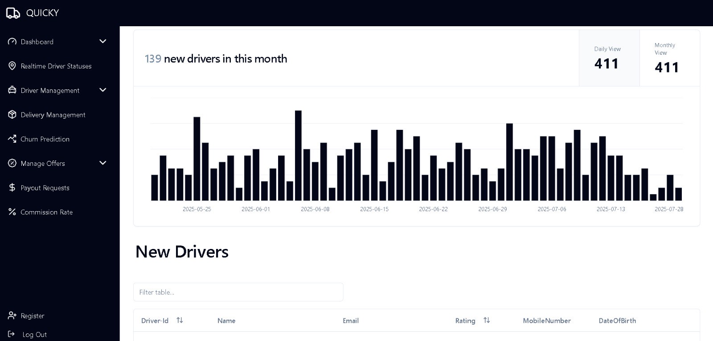
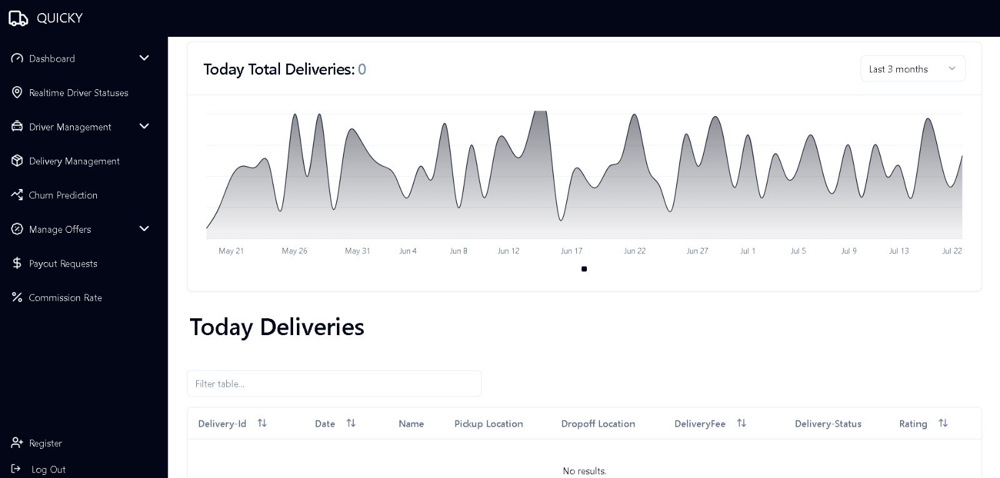
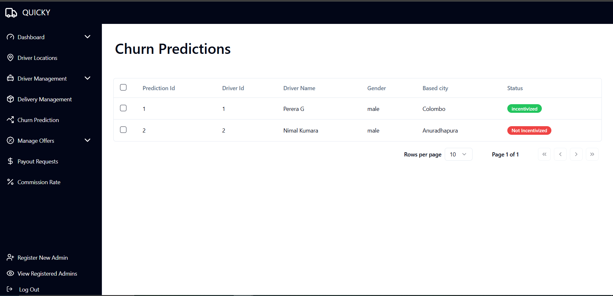
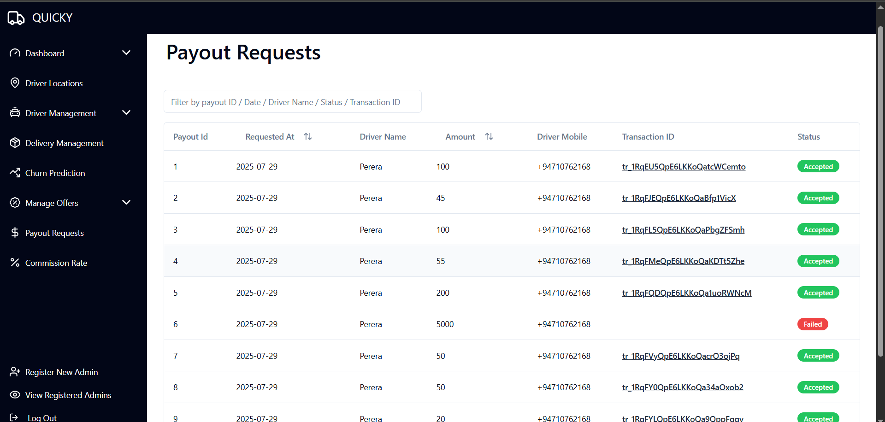
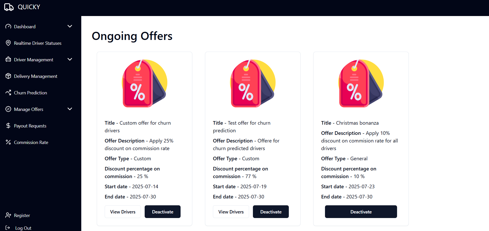
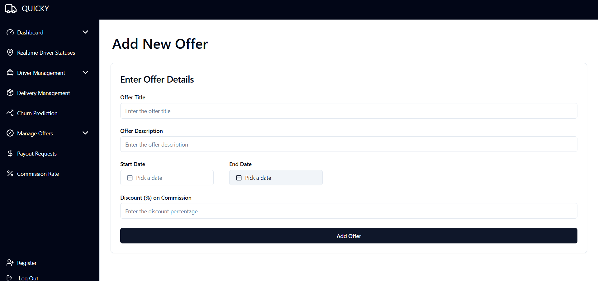
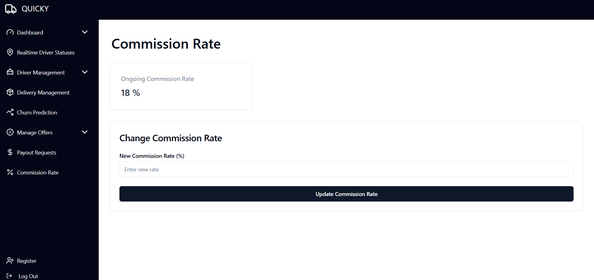

# Quicky Admin Churn Prediction Backend
This repository includes the project files related to admin churn prediction backend of Quicky delivery platform.

## Getting Started
To get started with the project, follow these steps:

1. Clone the repository:
    ```bash
    git clone https://github.com/HashiruG/Quicky_Admin_Churn_Prediction.git
    ```
2. Navigate to the project directory:
    ```bash
    cd Quicky_Admin_Churn_Prediction
    ```
3. Create a virtual environment:
    ```bash
    python -m venv venv
    ```
4. Activate the virtual environment:
    ```bash
    .\venv\Scripts\activate
    ```
5. Install dependencies:
    ```bash
    pip install -r requirements.txt
    ```
6. Run the server:
    ```bash
    uvicorn app.main:app --reload
    ```    

## Other Repositories associated with this project
1. Quicky admin main backend : [https://github.com/HashiruG/Quicky_Backend](https://github.com/HashiruG/Quicky_Backend)
2. Quicky admin frontend : [https://github.com/HashiruG/Quicky_Frontend](https://github.com/HashiruG/Quicky_Frontend) 

## Few Screenshots
<p align="center">
  
</p>
<p align="center">
  
</p>
<p align="center">
  
</p>
<p align="center">
  
</p>
<p align="center">
  
</p>
<p align="center">
  
</p>
<p align="center">
  
</p>
<p align="center">
  
</p>


